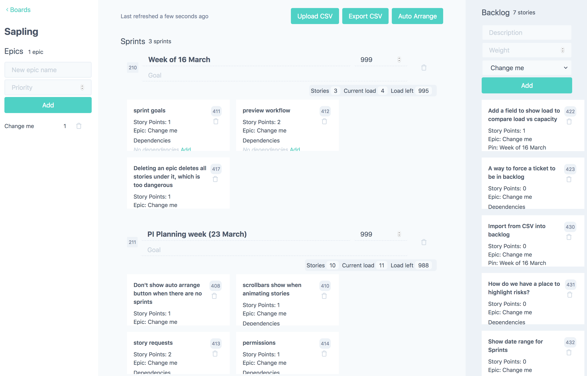

# Sapling



[Live demo](https://sapling.netlify.com/)

Create an account or use these credentials:

username: `demo@example.com`<br/>
password: `test`

## Presentation @ [RCoSE2020](http://www.continuous-se.org/RCoSE2020/)

[](http://www.youtube.com/watch?v=YRx6U-CHqsU)

## Using Sapling during [**PI planning**](https://www.scaledagileframework.com/pi-planning/)

The tool Sapling allows participants to do SAFe PI planning in a remote and distributed fashion in conjunction with video conferencing tools such as Zoom. Here is a sample agenda that explains how to use Sapling and Zoom.

**Prerequisite -**

- A zoom call where the [RTE](https://www.scaledagileframework.com/release-train-engineer-and-solution-train-engineer/) and [Scrum Masters](https://www.scaledagileframework.com/scrum-master/) (SM) are hosts
- Each scrum team has a board created in Sapling
- Product vision, architecture vision is ready to be shared with the teams

**Agenda –**

- Context setting with all members of the [Agile Release Train](https://www.scaledagileframework.com/agile-release-train/) for product and architecture roadmap
- Breakout into scrum teams using [Zoom's breakout rooms](https://support.zoom.us/hc/en-us/articles/206476313-Managing-Video-Breakout-Rooms) feature
  - [Product Owner](https://www.scaledagileframework.com/product-owner/) shares planning context describing features in priority order – this feeds into the "Epic" list in Sapling
  - Use the "Upload CSV" to import existing stories from any Agile Project Management tool like JIRA. 
  - Create sprints and fill in the "Capacity" of the team
  - Breakdown the epic by creating "Sprint goals" and adding "Stories" in the "Backlog" by assigning it to the epic
  - Create story dependencies using the "Dependencies" section in the story.
  - Use the "Auto-arrange" feature to automatically fill the stories created into sprints based on epic priority, story dependencies, story points and capacity. "Current load" and "Load left" give an overview of the how much Sprints are filled up
  - "Pin" a story to a particular sprint if you don't want the auto-arrange feature to move the story
  - By choosing the ellipses option on a story, add a "Cross board dependency" by choosing the board, epic and sprint. The receiving board will get a notification about the request and can choose to "Accept" or "Reject" the request
- [Scrum of Scrums](https://www.scaledagileframework.com/program-increment/)
  - While the teams are breaking down features, the SMs can move back to the main meeting to discuss progress and do check-ins
  - RTE being the host can also join the different rooms to observe any discussion if required
  - RTE and SMs can use the "Broadcast message" feature to give instructions or timing announcements.
- "Export to CSV" allows you to move your plans into your Agile Project Management tool such as JIRA.

## Deployment

- [Architecture](docs/architecture.md)
- [Deploying to Heroku](docs/heroku.md)
- [Deploying](docs/frontend.md) the [front end](https://github.com/srcclr/sapling-frontend)

## Development

Starting a local database

```sh
scripts/db.sh fresh
```

Updating jOOQ generated code

```sh
mvn compile -P codegen
```
